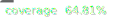

# parse-package-engines

<!--
 - SPDX-FileCopyrightText: 2025 Ferdinand Thiessen
 - SPDX-License-Identifier: MIT
-->

This is a GitHub action to parse the node version and the package manager (name and version) from a `package.json`.
The idea is that with the `setup-node` action currently `devEngines` is not supported, but it also does not to setup a specific package manager.

So this action is capable of parsing `engines`, `devEngines` as well as `packageManager` entries from a `package.json`.

## Usage
